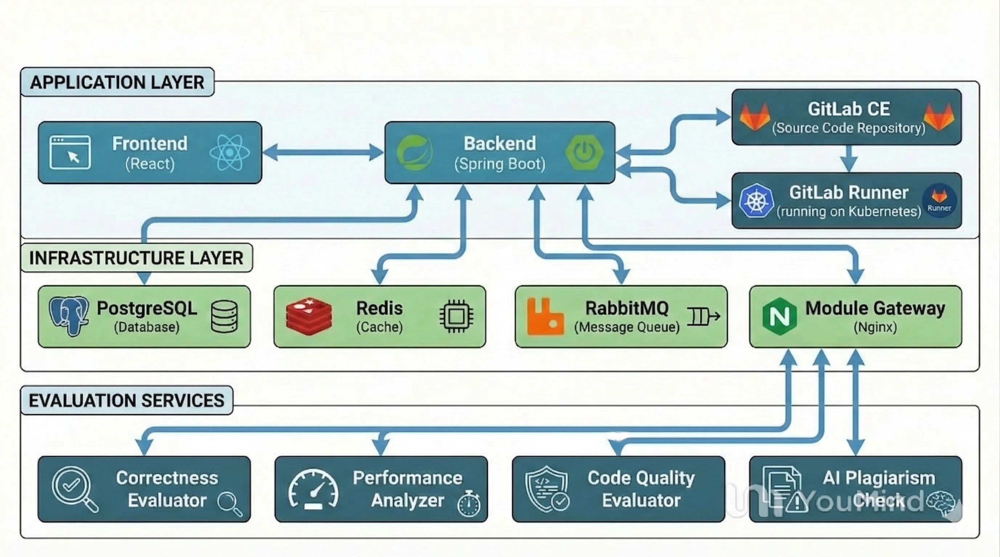

# Automated Assessment Environment For Programming Assignments

This platform grades programming assignments automatically. It spins up GitLab instances, runs student code through CI/CD pipelines, and uses AI microservices to leave feedback that goes beyond basic pass/fail metrics.

> [!NOTE]
> The platform automates the boilerplate setup. It creates GitLab groups, repositories, and CI runner configurations when you add a new course or assignment.

  

## Features

- **Automated Grading Pipelines**: Runs tests automatically through GitLab CI/CD pipelines.
- **Roles & Enrollments**: Built-in access levels and dashboards for admins, teachers, and students.
- **Assessment Modules**: Connects to microservices for code analysis, performance testing, and AI-detection.
- **Submission Constraints**: Teachers can set timeout limits, memory constraints, allowed dependencies, and trigger manual regrades on submissions.

## Core Modules

The platform calls three microservices during the pipeline run to grade student submissions:

- [**Error Evaluator and Best Practices Reviewer**](https://github.com/sarthak3d/LLM-code-Service)
  Runs automated code reviews using language models. It reads the code and leaves notes on readability and structure, similar to a code review from a peer.
- [**Performance Analyzer**](https://github.com/sarthak3d/Performance-analyzer)
  Profiles execution time and memory usage so instructors can enforce specific Big-O complexity requirements.
- [**AI Code Detector**](https://github.com/sarthak3d/AI-code-detector)
  Checks if submissions were likely written by AI chat tools, helping to catch academic integrity issues.

## Architecture

The system runs on a containerized stack:
- **Backend Application**: Java / Spring Boot. 
- **Platform Infrastructure**: Kubernetes (configured with Helm). It scales GitLab instances and CI runners automatically.
- **Database**: PostgreSQL.

> [!TIP]
> To see all available REST resources, including routes for submissions, webhooks, and grades, read the [**API Endpoints Documentation**](backend/API_ENDPOINTS.md).

## Getting Started

Since the platform spins up GitLab instances, GitLab Runners, and numerous microservices internally, it requires a fully-fledged Kubernetes environment.

We've split the deployment and startup configurations into dedicated guides:

- [**Fresh Installation Guide**](assets/doc/INSTALLATION.md)  
  A comprehensive guide to setting up the platform locally using Docker, Minikube, Helm, and our automated Bash wrapper. Use this if you are a new developer or setting up from scratch.
- [**Deployment Steps**](assets/doc/DEPLOYMENT-STEPS.md)  
  Direct Helm installation commands, runner verification checks, and instructions for running the automated End-to-End testing suite.

> [!IMPORTANT]
> Ensure all pods in the `assessment-platform` namespace are fully `Running` before executing the End-to-End scripts or relying on the GitLab Webhooks.
